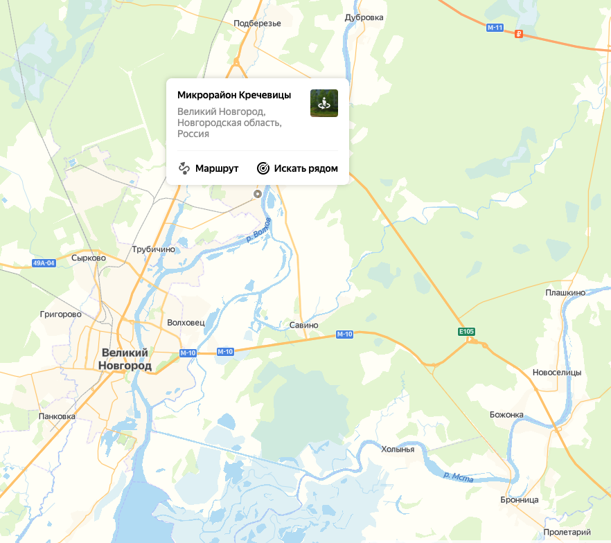
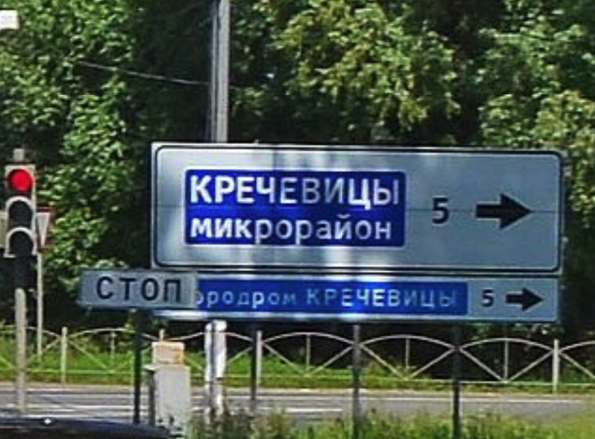

## Раположение
Великий Новгород расположен на Приильменской низменности, на реке Волхов, в 6 км от озера Ильмень, в 552 км к северо-западу от Москвы и в 145 км к юго-востоку от Санкт-Петербурга.
Южная граница городского округа Великий Новгород с 1999 года проходит у Рюрикова городища и Юрьева монастыря, огибая посёлок Панковка, и включая в себя земельный массив «Плетниха»
(с 15 марта 2013 года).
Северная граница городского округа — микрорайон Кречевицы (с 2004 года).

Кречеви́цы — микрорайон Великого Новгорода, до 2004 года — посёлок городского типа.
Эксклав Новгорода внутри соседнего Новгородского района, расположен на берегу реки Волхов, в 15 км к северу от основной территории Великого Новгорода.

Кречевицы на карте города:

Знак поворота на Кречевицы:

## Достопримечательности
- Городище «Холопий городок» (VIII—X вв)
- «Сопка», (VIII—X вв., культура псковских длинных курганов)

## Климат
Климат Великого Новгорода умеренно континентальный, с холодной снежной зимой и умеренно тёплым летом.
- Зима длится с середины ноября по начало апреля, её средняя температура составляет −4 °C, температура довольно часто опускается ниже −15 °C, обычно в конце января — начале февраля.
- Весна наступает примерно в первой неделе апреля, когда снежный покров тает и устанавливается устойчивая положительная температура, средняя температура апреля составляет около +3,5 °C.
- Лето умеренно тёплое, хотя июнь и август довольно прохладные месяцы, средняя температура июля +17,5 °C.
- Осень относительно мягкая и продолжительная, зима наступает только к середине ноября.

## Экология
В Великом Новгороде основную долю загрязнений (до 70 %) составляют выбросы автотранспорта.
Качество вод в реке Волхов в последние годы не меняется и по значениям УКИЗВ (удельный комбинаторный индекс загрязнённости вод) воды по-прежнему характеризуются как «загрязнённые».

Воды реки в районе города на протяжении нескольких лет загрязнены медью, марганцем, железом.
Значения бихроматной окисляемости (ХПК) по-прежнему превышают норму, что свидетельствует о загрязнении вод органическими веществами.
